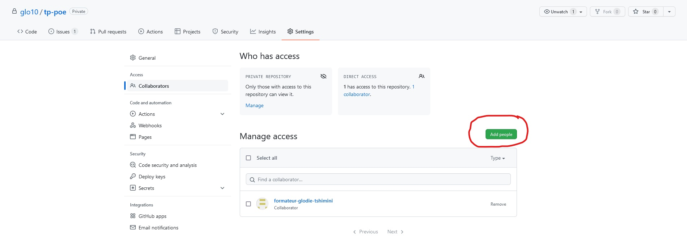
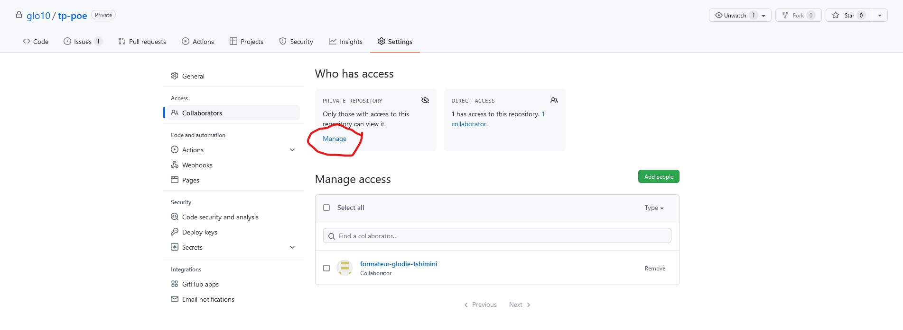
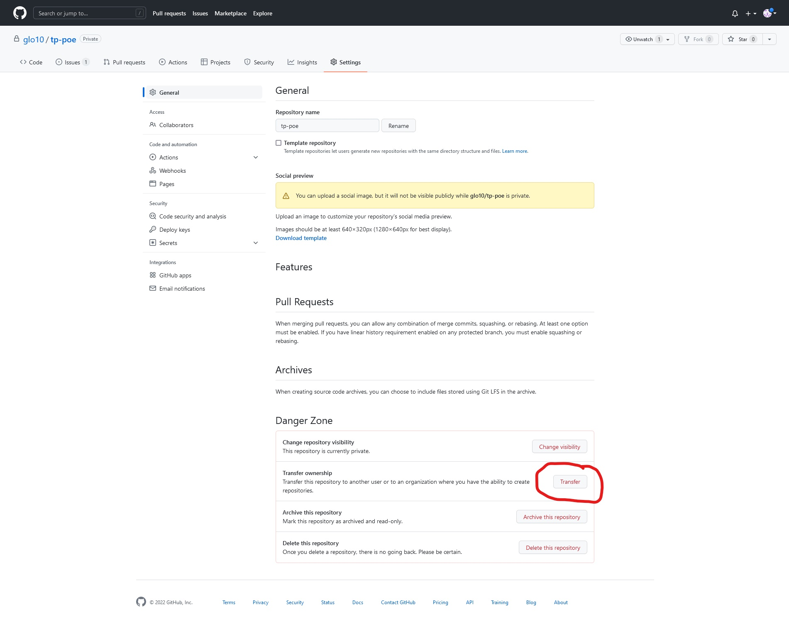

# Travail collaboratif avec Git et GitHub

#### Objectifs du TP

1. Travailler à plusieurs sur le même dépôt
2. Créer et résoudre des conflits
3. Se familiariser avec GitHub
4. Se familiariser avec le jargon technique
5. Se familiariser avec le format markdown (extension .md), utilisé pour la documentation sur des projets git

### Explications du jargon technique

- *Owner* : propriétaire du dépôt
- *Developers* : collaborateurs qui peuvent apporter des modifications au dépôt
- *Maintenairs* : collaborateurs qui ont un peu plus de droits que les developers
- *Issue* : problème à résoudre, généralement on crée un issue lorsqu'on souhaite affecter un développeur sur une tâche, ça peut être un bug,une nouvelle fonctionnalité, de la documentation etc... Généralement l'issue débouche sur la création d'une nouvelle branche portant le même nom que l'issue pour résoudre un problème.
- *Pull/Merge request* : il s'agit d'une demande de soumission de votre code (vos modifications sur un projet) au propriétaire du dépôt pour que celui-ci puisse être intégré dans le projet.
Lorsque le propriétaire accepte votre travail, vos modifications seront mergées(intégrées) dans la branche main.
Lorsqu'il refuse, il vous dira pourquoi à l'aide des fonctionnalités proposés par les hébergeurs de dépôt distant comme GitHub, Bitbucket, Gitlab.
Chaque propriétaire impose ses exigences dans une documentation (le README.md par exemple) au niveau du processus globale, le nommage des commits, la qualité du code, les tests unitaires, intégrations et fonctionnelles à effectuer.
- README.md : à la racine du projet, fichier contenant les instructions pour installer le projet plus généralement la documentation du projet. Il peut y en avoir ailleurs dans les sous-dossiers du projet avec des instrutions plus spécifiques une partie du projet.
- .gitignore : à la racine du projet, fichier permettant d'ignorer certains fichiers ou dossiers qu'on ne souhaite versionner.
- Assigner : Désigner un collaborateur pour effectuer une tâche
- Reviewer : La personne qui va effectuer de la revue de code (revoir,vérifier, corriger votre code)
#### Formation des groupes

- Groupe de 3 personnes
- Dans chaque groupe, il y aura 1 personne avec le rôle de owner(propriétaire du dépôt) et 2 personnes avec le rôle de Developpers
  - 1 *Owner* : créateur et responsable du dépôt Git
  - 2 *Developers* : développeurs qui participent au projet

## PARTIE 1

#### Mission du *owner*

- Tâches du *owner*
1. Créez un dépôt GitHub nommé ***tp-git*** avec les fichiers suivants :
   - ***README.md*** contenant les instructions adressées aux collaborateurs pour récupérer le dépôt 
   - ***.gitignore***
   
2. Invitez les 2 développeurs qui doivent collaborer dans ce projet et le formateur dont l'adresse e-mail est *contact@tshimini.fr*

   - **Settings > General > Access > Collaborators > add people**

   **Illustration**

3. Désignez le développeur 1 et le développeur 2 (nécessaire pour attribuer les tâches à chacun)

4. Créez deux *issues* : 

   1. Première *issue* nommée ***feature/morning_menu*** et assignez le développeur 1

   2. Deuxième *issue* nommée ***feature/lunch_menu*** et assignez le développeur 2

      Vous pouvez ajouter les **labels** de votre choix dans la liste proposée à la création
      **Illustrations**
      
      
5. En local :
   
   1. Récupérez le dépôt distant
   2. Créez une branche nommée ***main*** 
   3. Modifiez la mise en page ***README.md*** en suivant ce [guide](https://docs.framasoft.org/fr/grav/markdown.html)
   4. Pushez
  
6. Acceptez, publiez ou rejetez-les *pull requests* de vos développeurs
  
   - En cas de rejet, indiquez à vos développeurs le motif du refus grâce aux outils mis à disposition sur GitHub
   - Gérez les conflits lors des *merge requests* sur la branche *main*
  
7. Après avoir effectué les *merge request*s des travaux de vos développeurs sur la branche *main*
  
   1. Créez une *issue* nommée ***feature/prices*** et assignez-le à vous même
   2. Créez une nouvelle branche qui porte le même nom que *issue*
   3. Ajoutez les prix aux produits présents sur chaque ligne des fichiers ***menu.md*** et ***drink.md***
   4. Pushez vos modifications sur le dépôt distant
   5. Effectuez le *merge requests* de cette branche dans la branche *main*
  
8. Prévenez vos collaborateurs de l'ajout des prix

#### Missions du premier développeur

1. Acceptez l'invitation reçue 
2. Récupérez le projet en local
3. Créez une nouvelle branche portant le même nom que *issue* qui vous a été assignée
4. **A la racine du projet**
   1. Créez un fichier nommé ***menu.md*** qui doit contenir vos viennoiseries préférées
   2. Créez un fichier nommé ***drink.md*** contenant vos boissons favorites pour le petit-déjeuner 
5. Commitez et pushez vers le dépôt distant sur la branche *feature/morning_menu*
6. Faites une demande de *pull request* :
   1. En mettant le développeur 2 en tant que ***Reviewers*** pour la revue du code
   2. Assignez le *owner* dans ***Assignees***
   3. Ajoutez un petit commentaire pour expliquer votre travail
7. Après avoir été notifié de l'ajout des prix par le *owner*
   1. Récupérez tous les changements effectués sur le dépôt distant en local
   2. En cas de conflits, gérez-les en communiquant avec vos collaborateurs
8. Créez une nouvelle branche pour modifier la mise en page des fichiers *menu.md*  et *drink.md* en suivant ce [guide](https://docs.framasoft.org/fr/grav/markdown.html)
9. Soumettez cette branche pour une intégration dans la branche *main* 

#### Missions du second développeur

1. Acceptez l'invitation reçue 
2. Récupérez le projet en local
3. Créez une nouvelle branche portant le même nom que *issue* qui vous a été assignée
4. **A la racine du projet**
   1. Créez un fichier nommé ***menu.md*** qui doit contenir vos plats préférés
   2. Créez un fichier nommé  ***drink.md*** contenant vos boissons favorites pour le déjeuner 
5. Commitez et pushez vers le dépôt distant sur la branche *feature/lunch_menu*
6. Faites une demande de *pull request* :
   1. En mettant le développeur 1 en tant que ***Reviewers*** pour la revue du code
   2. Assignez le *owner* dans ***Assignees***
   3. Ajoutez un petit commentaire pour expliquer votre travail
7. Après avoir été notifié de l'ajout des prix par le *owner*
   1. Récupérez tous les changements effectués sur le dépôt distant en local
   2. En cas de conflits, gérez-les en communiquant avec vos collaborateurs
8. Créez une nouvelle branche pour modifier la mise en page des fichiers *menu.md* et *drink.md* en suivant ce [guide](https://docs.framasoft.org/fr/grav/markdown.html)
9. Soumettez cette branche pour une intégration dans la branche *main* 

### PARTIE 2

**En total autonomie**

1. Echangez vos rôles
2. Concertez-vous pour créer des nouvelles *issues* et branches dans le but : 
   - D'étoffer le contenu des fichiers *menu.md* et *drink.md* 
   - De restructurer l'arborescence des fichiers en créant des nouveaux dossiers et/ou fichiers par exemple
   - D'ajouter quelques photos
   - **Et tout ce qui vous passe par la tête**

**Illustrations pour transférer le rôle d'*Owner* à un autre collaborateur**

